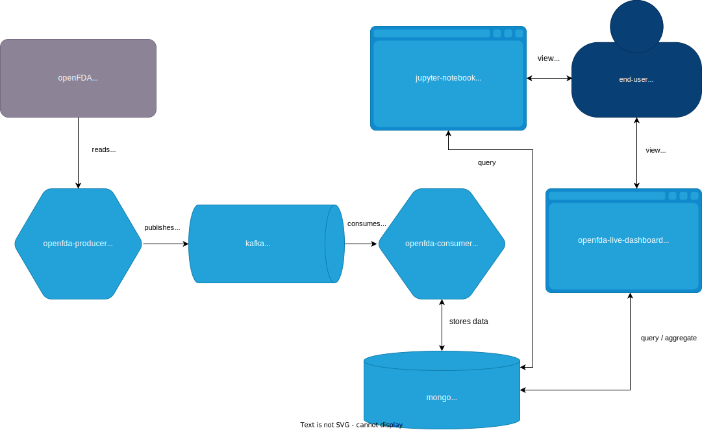

# OpenFDA BigData Pipeline

**OpenFDA BigData Pipeline** enables collection, processing, and real-time presentation of data - on adverse drug events from the [openFDA](https://open.fda.gov/apis/drug/) database.

The solution uses [Apache Kafka](https://kafka.apache.org/) as a message broker, [Mongo DB](https://www.mongodb.com) as a document storage, [Spring Boot](https://spring.io/projects/spring-boot) for services and is Dockerized.

## Contents

This repository contains the code for the openFDA BigData Pipeline solution

* [openfda-producer](openfda-producer) it's a microservice build with [Spring Boot](https://spring.io/projects/spring-boot) and written in [Java](https://www.java.com)
* [openfda-consumer](openfda-consumer) it's a microservice build with [Spring Boot](https://spring.io/projects/spring-boot) and written in [Java](https://www.java.com)
* [openfda-live-dashboard](openfda-live-dashboard) it's a web application build with [Flask](https://flask.palletsprojects.com/), [Dash](https://dash.plotly.com/) and written in [Python](https://www.python.org/)

##  Architecture

##  Configuration

The project runs with the default configuration defined in each of services and in `pipeline.yml`. For more details refer directly to:

* [openfda-producer](openfda-producer/README.md)
* [openfda-consumer](openfda-consumer/README.md)
* [openfda-live-dashboard](openfda-live-dashboard/README.md)
* [pipeline](pipeline.yml)

##  Running solution locally in Docker

If you intend to try running project yourself, I have put together a `pipeline.yml` configuration that can help you get started. 

Calling the following command

``
docker-compose -f pipeline.yml up
``

will:

* Start `openfda-producer` container 
* Start `zookeper` container
* Start `kafka` container
* Start `mongodb` container
* Start `openfda-consumer` container
* Start `openfda-live-dashboard` container which will expose port `8050`
* Start `jupyter-notebook` container which will expose port `8888`

## Accessing the application

Once all your Docker containers are up and running you can access `openfda-live-dashaboard` web dashboard via a browser under the following URL:

[http://localhost:8050](http://localhost:8050) 

In addition, you can access Jupyter Notebook `jupyter-notebook` via a browser under the following URL:

[http://localhost:8888](http://localhost:8888) 

## Example graphs

### Top 20 patient reactions reported between 2020-01-01 and 2022-01-01

### Top 20 patient medical products reported between 2020-01-01 and 2022-01-01

## Issues and contribution

Bug reports and pull requests are welcome on GitHub at https://github.com/koziolk/openfda-bigdata-pipeline
